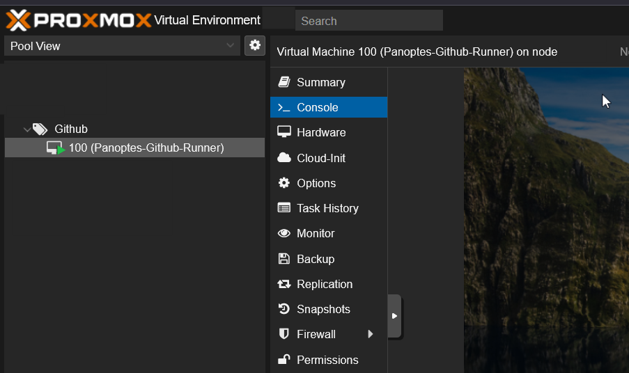

# Panoptes-Infrastructure
This repo contains the Terraform and Ansible scripts to setup a Windows Development Computer on Proxmox:
- [Windows Kernel Development](https://learn.microsoft.com/en-us/windows-hardware/drivers/download-the-wdk)
- [Github Runner Setup](https://docs.github.com/en/actions/hosting-your-own-runners/managing-self-hosted-runners/adding-self-hosted-runners)
- [Install Wix Toolset](https://www.firegiant.com/wixtoolset/) version 5 (Creating MSI files)
- [Install Advance Installer](https://www.advancedinstaller.com/) (Creating MSI files)

## Usage

First ensure that you have Terraform and Ansible properly setup. Once installed you need to setup your Terraform variables in variables.tfvars. The format of this will look like so:

```
proxmox_domain          = "proxmox.example.com"
proxmox_user            = "terraform"
proxmox_token_name      = "mytoken"
proxmox_token_secret    = "b99fac35-108f-4a1c-8e15-511b51637611"
node_name               = "pxe"
ip_range_cidr           = "192.168.1.1/24"
```

Once this has been configured with the desired settings you can execute the following commands:

```
terraform init
terraform plan -var-file="variables.tfvars"
terraform apply -var-file="variables.tfvars"
```

If you did not setup Cloud-Init you maybe able to get the IP of VM or LXC using nmap.

You may also have to manually enable and start SSH.

Once the infrastructure has been deployed you can then head over to the ~/ansible folder. Here we will need to either hardcode the settings we want or we can use ansible-vault to store our variables. The vault should look something like so:

```
win_ip_address: 192.168.1.120
win_username: Research
win_password: changeme
winrm_port: 5985
github_repo: Panoptes
github_owner: Ap3x
github_api_key: github_pat_ABC123

```

Once you configured the variables and set the proper IP in the hosts.ini you can then begin to execute the following commands:

```shell
# Create a vault if havent already done so
ansible-vault create vault.yml
# To use nano editor: export EDITOR=nano
# Fill out the vault with all the appropriate variables 
ansible-playbook -i hosts.ini Windows-Kernel-Development.yml --ask-vault-pass
```

You should now have all the files and dependencies installed to setup a Windows Development environment or setup a Windows Github Runner for your Github repo. If properly deployed you should have a Windows VM in Proxmox

